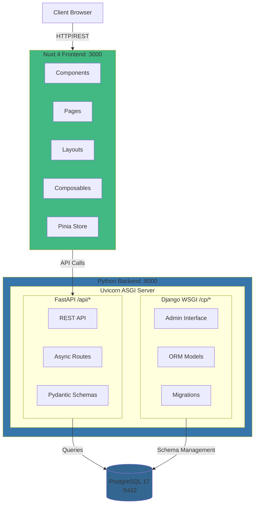
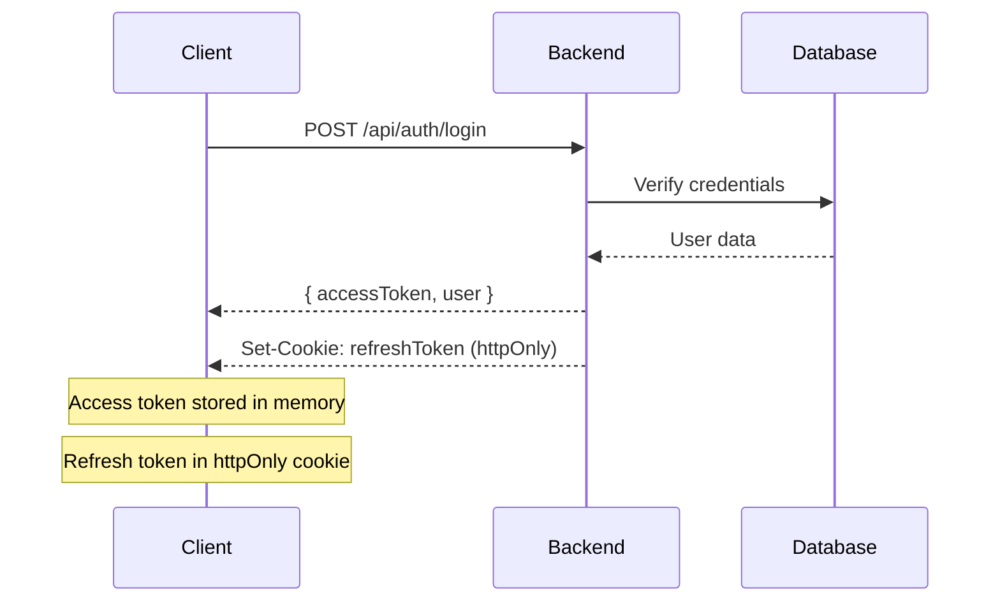
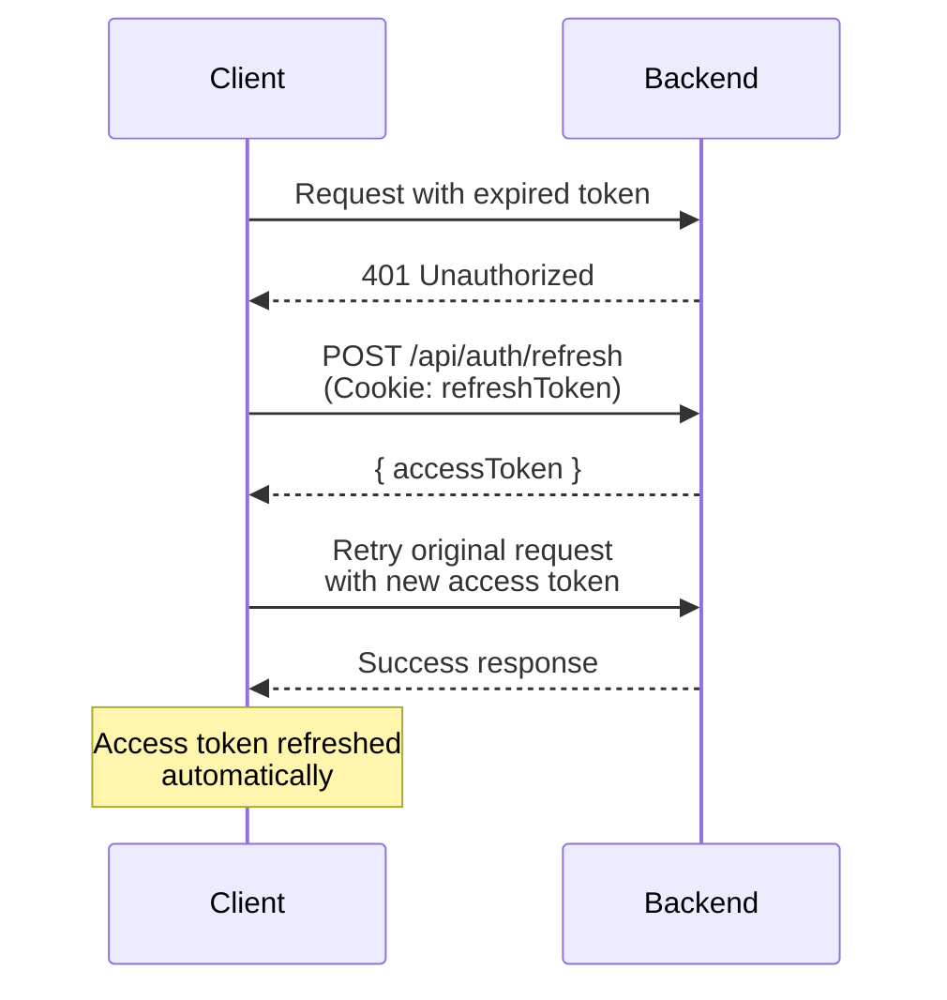

# Architecture

PyNuxtBase uses a unique **hybrid backend architecture** that combines Django and FastAPI in a single process. This design provides the best of both frameworks while maintaining simplicity.

## System Overview



## Hybrid Backend Design

The backend architecture is the most unique aspect of PyNuxtBase. It runs **both Django and FastAPI in a single process**.

### Why Hybrid?

This design combines:
- **Django's strengths**: Mature ORM, built-in admin, robust migrations, authentication
- **FastAPI's strengths**: Modern async API, automatic documentation, high performance

### How It Works

#### 1. Single Entry Point (`src/backend/main.py`)

```python
from fastapi import FastAPI
from a2wsgi import ASGIMiddleware
from django.core.wsgi import get_wsgi_application

# Initialize Django
os.environ.setdefault('DJANGO_SETTINGS_MODULE', 'app.django_app.settings')
django.setup()

# Create FastAPI app
app = FastAPI()

# Mount FastAPI routes at /api
app.include_router(api_router, prefix="/api")

# Mount Django WSGI at /cp
django_app = get_wsgi_application()
app.mount("/cp", ASGIMiddleware(django_app))

# Run with Uvicorn
uvicorn.run(app, host="0.0.0.0", port=8000)
```

#### 2. Django Responsibilities

- **Database Models**: Define all models in `app/django_app/apps/*/models.py`
- **Migrations**: Use `python manage.py migrate` to manage schema
- **Admin Interface**: Available at `/cp/admin` for data management
- **ORM**: All database queries use Django ORM

#### 3. FastAPI Responsibilities

- **API Endpoints**: REST API routes in `app/api/routers/`
- **Request Handling**: Async request/response processing
- **Validation**: Pydantic schemas for request/response validation
- **Documentation**: Auto-generated OpenAPI docs at `/api/docs`

#### 4. Shared Database

Both frameworks share the same PostgreSQL database:
- Django manages the schema (migrations)
- FastAPI imports Django models for queries
- All database operations use Django ORM (even in FastAPI)

## Frontend Architecture

The frontend is built with **Nuxt 4**, providing both server-side rendering (SSR) and client-side navigation.

### Directory Structure

```
src/frontend/app/
├── assets/           # Global styles (Tailwind CSS 4 config)
├── components/       # Vue components
│   └── ui/          # Design system components
├── composables/     # Composition API functions (auto-imported)
│   └── api/        # API client functions
├── constants/       # App constants (API endpoints, config)
├── layouts/         # Nuxt layouts
├── middleware/      # Route middleware
├── pages/           # File-based routing
├── store/           # Pinia stores
└── types/           # TypeScript types
```

### Key Concepts

#### Auto-Imports

Nuxt 4 auto-imports:
- Vue APIs (`ref`, `computed`, `onMounted`, etc.)
- Composables from `composables/`
- Components from `components/`

**No manual imports needed!**

#### API Integration

All API calls use composables from `composables/api/`:

```typescript
// In a component
const { login } = useAuth()
const { fetchUsers } = useUsers()

// Automatically includes auth tokens
await login({ username, password })
const users = await fetchUsers()
```

#### State Management

Pinia stores handle global state:

```typescript
// app/store/auth.ts
export const useAuthStore = defineStore('auth', {
  state: () => ({
    user: null,
    accessToken: null,
  }),
  actions: {
    async login(credentials) {
      // Login logic
    }
  }
})
```

## Database Schema

### UUID Primary Keys

All models use **UUID primary keys** instead of auto-incrementing integers:

```python
# Django model
class User(models.Model):
    id = models.UUIDField(primary_key=True, default=uuid.uuid4)
    username = models.CharField(max_length=150, unique=True)
    email = models.EmailField(unique=True)
```

Benefits:
- ✅ Prevents ID enumeration attacks
- ✅ Globally unique identifiers
- ✅ No conflicts when merging databases

### PostgreSQL 17

PyNuxtBase uses **PostgreSQL 17**, which provides:
- Advanced indexing (B-tree, GiST, SP-GiST, GIN, BRIN)
- Full-text search
- JSON/JSONB support
- Row-level security
- Partitioning

## Authentication Flow

PyNuxtBase uses **JWT (JSON Web Tokens)** with refresh tokens:

### Token Strategy

1. **Access Token**: Short-lived (15 minutes), stored in memory
2. **Refresh Token**: Long-lived (7 days), stored in httpOnly cookie

### Login Flow



### Token Refresh Flow

When access token expires:



## Design System

The frontend includes a comprehensive design system with:

### UI Components

Located in `app/components/ui/`:

- **Button**: Multiple variants (primary, secondary, outline, ghost, danger)
- **Input**: Form inputs with validation states
- **Select**: Searchable dropdown
- **Modal**: Dialog with teleport
- **Card**: Content containers
- **Toast**: Notifications (success, error, warning, info)
- **Loading**: Spinners and skeleton loaders
- **ErrorState**: Error display with retry

### Design Tokens

CSS custom properties in `app/assets/main.css`:

```css
:root {
  --color-primary: oklch(65% 0.25 270);
  --color-neutral-50: oklch(98% 0 0);
  --spacing-1: 0.25rem;
  --shadow-sm: 0 1px 2px rgba(0, 0, 0, 0.05);
}
```

## Development Workflow

### Local Development

1. **Start infrastructure**: `docker compose up -d`
2. **Start backend**: `python main.py` (port 8000)
3. **Start frontend**: `npm run dev` (port 3000)

### API Development

1. Define Django models in `app/django_app/apps/*/models.py`
2. Create migrations: `python manage.py makemigrations`
3. Run migrations: `python manage.py migrate`
4. Create Pydantic schemas in `app/api/schemas/`
5. Create FastAPI routes in `app/api/routers/`
6. Test at `/api/docs`

### Frontend Development

1. Create components in `app/components/`
2. Define pages in `app/pages/` (file-based routing)
3. Add composables in `app/composables/api/` for API calls
4. Use Pinia stores for global state
5. Hot-reload at `localhost:3000`

## Next Steps

- 🎨 [Frontend Development Guide](./frontend) - Detailed frontend development
- 🐍 [Backend Development Guide](./backend) - Detailed backend development
