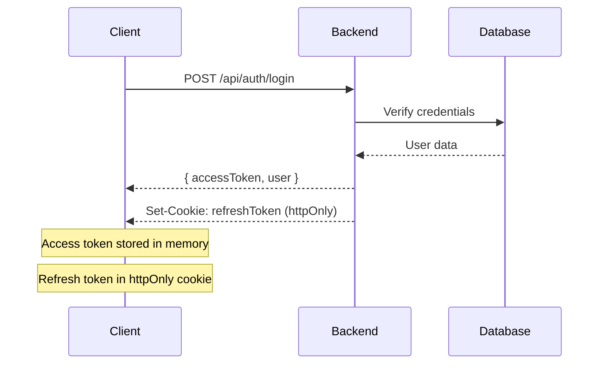
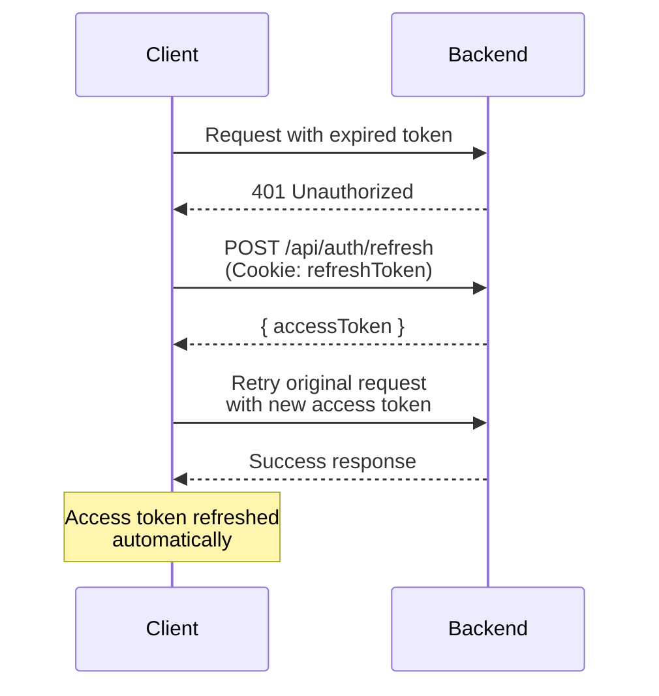

# Authentication

PyNuxtBase uses **JWT (JSON Web Tokens)** with refresh tokens:

## Token Strategy

1. **Access Token**: Short-lived (15 minutes), stored in memory
2. **Refresh Token**: Long-lived (7 days), stored in httpOnly cookie

## Login Flow

## Token Refresh Flow

When access token expires:

