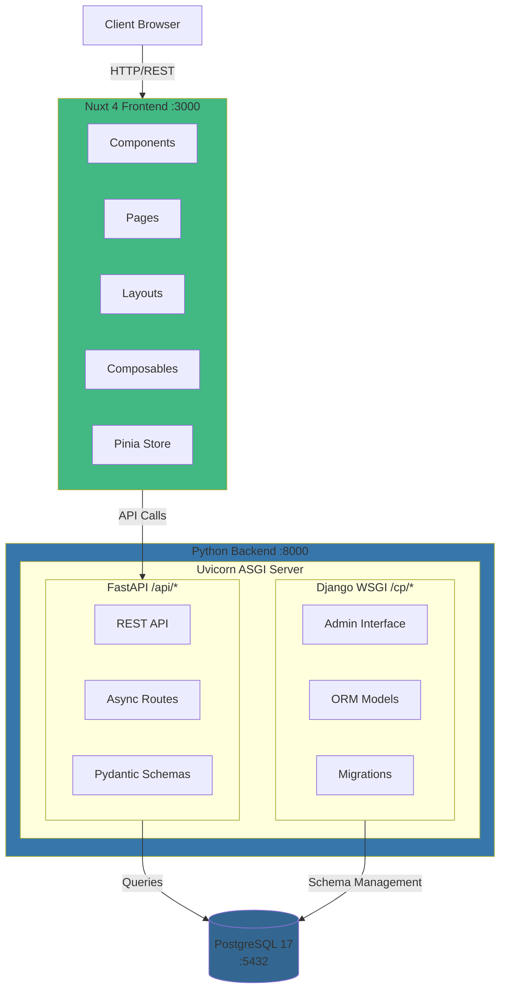

# System Overview

## Key Components

### Frontend (Port 3000)

- **Nuxt 4** - Server-side rendering and static generation
- **Vue 3** - Progressive JavaScript framework
- **Tailwind CSS 4** - Utility-first styling
- **Pinia** - State management
- **Composables** - Auto-imported API and utility functions

### Backend (Port 8000)

- **FastAPI** - Async REST API at `/api/*`
- **Django** - Admin and ORM at `/cp/*`
- **Uvicorn** - ASGI server running both frameworks

### Database

- **PostgreSQL 17** - Shared database for both frameworks
- **UUID Primary Keys** - Security and uniqueness
