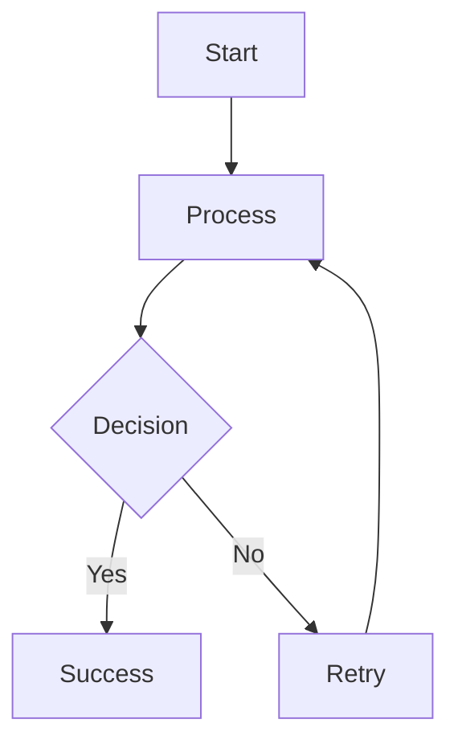

# Welcome

Welcome to my documentation site.

This site showcases my open-source projects and provides comprehensive documentation for each.

## Featured Projects

Browse the projects listed on the homepage, or explore the documentation using the sidebar.

## Documentation Features

This documentation site supports:

- **Markdown** - Write docs in Markdown format
- **MDX** - Use React components in Markdown
- **Code Blocks** - Syntax-highlighted code examples
- **Mermaid Diagrams** - Create diagrams using Mermaid syntax

### Creating Diagrams

You can create diagrams using Mermaid syntax:

````markdown

````

This renders as:


## Explore Projects

- **[PyNuxtBase](./PyNuxtBase/)** - Full-stack foundation with Nuxt 4, FastAPI, and Django
